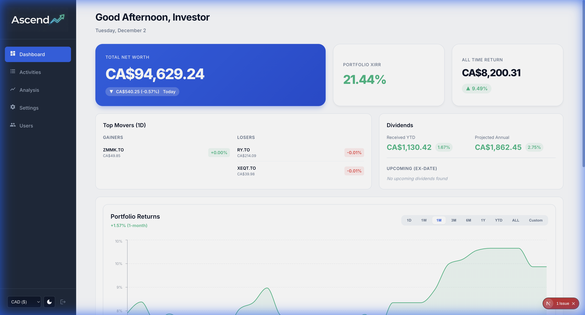
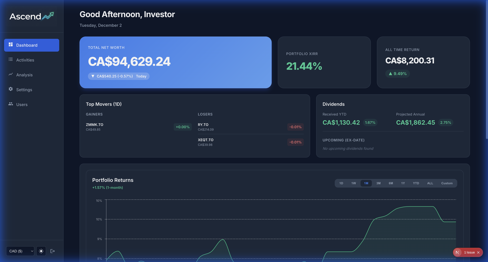

# Ascend - Personal Portfolio Manager

A comprehensive, self-hosted portfolio management application designed to track your investments across multiple accounts and currencies.

<p align="center">
  
  &nbsp; &nbsp;
  
</p>

## Features

-   **Multi-Currency Support**: Track investments in their native currency and view your portfolio value in your preferred base currency (e.g., USD, CAD, INR).
-   **Performance Tracking**:
    -   **XIRR Calculation**: Accurate return on investment considering cash flows.
    -   **Time-Weighted Return**: Compare your performance against benchmarks.
    -   **Treemap Visualization**: Visualize your portfolio composition and performance at a glance.
-   **Asset Allocation**: Breakdown by asset type, platform, and account.
-   **Dividend Tracking**: Monitor upcoming dividends and projected annual income.
-   **Dark Mode**: Sleek, eye-friendly interface.
-   **Privacy Focused**: Self-hosted solution ensures you own your financial data.

## Installation

### Option 1: Docker (Recommended - Pre-built Image)

The fastest way to get started using the official pre-built image (supports `amd64` and `arm64`).

**Prerequisites:**
-   [Docker](https://docs.docker.com/get-docker/)
-   [Docker Compose](https://docs.docker.com/compose/install/)

**Steps:**

1.  **Create a directory** for the project and enter it:
    ```bash
    mkdir portfolio-app && cd portfolio-app
    ```

2.  **Configure Environment:**
    Create a `.env` file with the following content (or copy from `env.example` if you have the source):
    ```env
    # Database
    POSTGRES_USER=postgres
    POSTGRES_PASSWORD=postgres
    POSTGRES_DB=portfolio_db

    # Next Auth
    NEXTAUTH_URL="http://localhost:3000"
    NEXTAUTH_SECRET="your_secure_random_secret_here" # Generate with: openssl rand -base64 32
    AUTH_TRUST_HOST=true

    # Seeding
    ADMIN_PASSWORD="admin123"
    ```

3.  **Create `docker-compose.yml`**:
    Create a file named `docker-compose.yml` with the following content:
    ```yaml
    services:
      app:
        image: rajatpatel7/portfolio-app:latest
        container_name: portfolio-app
        restart: always
        ports:
          - "3000:3000"
        environment:
          - DATABASE_URL=postgresql://${POSTGRES_USER}:${POSTGRES_PASSWORD}@db:5432/${POSTGRES_DB}
          - NEXTAUTH_URL=${NEXTAUTH_URL}
          - NEXTAUTH_SECRET=${NEXTAUTH_SECRET}
          - AUTH_TRUST_HOST=true
          - ADMIN_PASSWORD=${ADMIN_PASSWORD}
        depends_on:
          - db
        networks:
          - portfolio-network

      db:
        image: postgres:15-alpine
        container_name: portfolio-db
        restart: always
        environment:
          - POSTGRES_USER=${POSTGRES_USER}
          - POSTGRES_PASSWORD=${POSTGRES_PASSWORD}
          - POSTGRES_DB=${POSTGRES_DB}
        volumes:
          - postgres_data:/var/lib/postgresql/data
        networks:
          - portfolio-network

    networks:
      portfolio-network:
        driver: bridge

    volumes:
      postgres_data:
    ```

4.  **Start the Application:**
    ```bash
    docker-compose up -d
    ```

5.  **Access the Dashboard:**
    Open [http://localhost:3000](http://localhost:3000).
    -   **Default Admin Credentials**: `admin` / `admin123` (or as configured in `.env`)

---

### Option 2: Docker (Build from Source)

If you want to modify the code or build the image yourself.

1.  **Clone the repository:**
    ```bash
    git clone <your-repo-url>
    cd portfolio-app
    ```

2.  **Configure Environment:**
    ```bash
    cp env.example .env
    ```
    *Update `.env` with your preferred credentials if needed.*

3.  **Run with Docker Compose:**
    ```bash
    docker-compose up -d --build
    ```

---

### Option 3: Local Installation

For development or running without Docker.

**Prerequisites:**
-   [Node.js](https://nodejs.org/) (v18 or higher)
-   [PostgreSQL](https://www.postgresql.org/) database

**Steps:**

1.  **Clone and Install Dependencies:**
    ```bash
    git clone <your-repo-url>
    cd portfolio-app
    npm install
    ```

2.  **Configure Environment:**
    ```bash
    cp env.example .env
    ```
    Update `.env` with your local PostgreSQL credentials.

3.  **Setup Database:**
    ```bash
    npx prisma migrate dev
    npx prisma db seed
    ```

4.  **Start the Development Server:**
    ```bash
    npm run dev
    ```

## Tech Stack

-   **Framework**: [Next.js](https://nextjs.org/) (App Router)
-   **Database**: PostgreSQL with [Prisma ORM](https://www.prisma.io/)
-   **Styling**: CSS Modules
-   **Charts**: Recharts & Chart.js
-   **Authentication**: NextAuth.js
